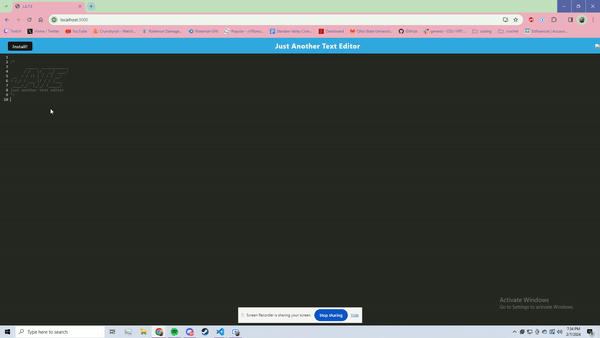

# pwa-text-editor

# 19 Progressive Web Applications (PWA): Text Editor

## Just Another Text Editor (JATE)

This web application is a simple text editor. Users can install the application and use it with or without internet connection. This application uses Webpack, Concurrently, Express, Nodejs and Babel.

## User Story

```md
AS A developer
I WANT to create notes or code snippets with or without an internet connection
SO THAT I can reliably retrieve them for later use
```

## Mock-Up
